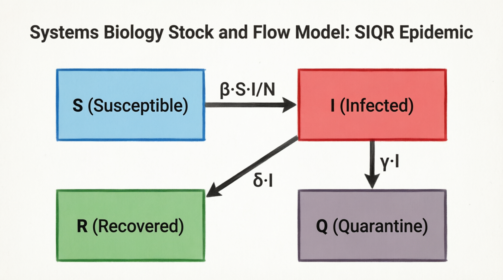
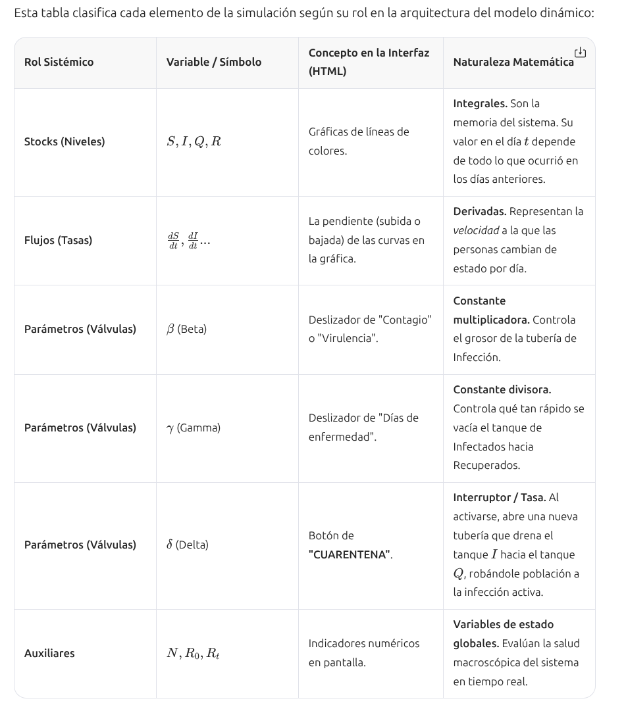

# MODELO EPIDEMICO

# **1. El Modelo Subyacente: Dinámica de Poblaciones (Tipo SIR/SIQR)**

El modelo trata a la población no como individuos aislados, sino como un sistema complejo donde los flujos de individuos entre diferentes "estados" o compartimentos dependen de las interacciones (contactos) y de las reglas biológicas del patógeno.

## **Variables de Estado (Los Compartimentos)**

El sistema se divide en variables que representan la fracción o el número de individuos en un estado biológico específico en el tiempo *t*:

 - ***S(t)* (Susceptibles):** Individuos sanos que no tienen inmunidad y pueden contraer la enfermedad si entran en contacto con el patógeno. Es el "combustible" de la epidemia.

 - ***I(t)* (Infectados / Infecciosos):** Individuos que han contraído el patógeno y tienen la capacidad de transmitirlo a los susceptibles. Representan la carga viral circulante en el sistema.

 - ***R(t)* (Recuperados / Removidos):** Individuos que han superado la infección y han desarrollado inmunidad (o han fallecido). Ya no participan en la cadena de transmisión.

 - ***Q(t)* (Cuarentena / Aislados):** Variable introducida al activar la opción "CUARENTENA". Representa a los individuos infectados que son retirados forzadamente de la red de contactos sociales, impidiendo que sigan propagando el virus.
  
# 2. **Los "PARÁMETROS" del Sistema**
En la sección de "PARÁMETROS" de la interfaz, el usuario modifica las constantes que definen la biología del virus y el comportamiento de la red social:

 - ***β* (Beta - Tasa de Transmisión):** Representa la probabilidad de contagio por contacto multiplicada por la tasa de contactos promedio en la red social. Determina qué tan rápido fluyen los individuos de *S→I*.

 - **γ* (Gamma - Tasa de Recuperación):** Es el inverso del tiempo promedio que dura la infección (1/D). Determina la velocidad del flujo de *I→R*.

 - ***δ* (Delta - Tasa de Detección/Aislamiento):** Es el parámetro clave de la Cuarentena. Representa la velocidad del sistema de salud para testear y aislar a los infectados.

 - ***R0* (Número Básico de Reproducción):** Es un parámetro emergente calculado como *R0=β/γ*. 
   - ***Significado:*** Indica a cuántas personas infecta en promedio un solo individuo en una población 100% susceptible. Si *R0 >1*, el sistema entra en epidemia (crecimiento exponencial).
 - ***Eficacia de la Cuarentena:*** Un parámetro de control que reduce artificialmente la tasa de contacto *(β)* o mueve individuos al estado *Q* antes de que puedan infectar a otros.

# 3. **Análisis de los Escenarios ("Caso Simple" vs. "CUARENTENA")**

## Caso Simple (Sistema No Intervenido):

  - Simula la dinámica natural del patógeno sin perturbaciones externas.
  - **Comportamiento Sistémico:** Se observa un crecimiento exponencial de los infectados (I) hasta que se agotan los susceptibles *(S)*, alcanzando un pico epidémico agudo y rápido.
  - **Resultado:** La inmunidad de rebaño se alcanza rápidamente, pero el costo es un pico de infecciones simultáneas que suele superar la capacidad de carga del sistema de salud (colapso hospitalario).
   - 
## CUARENTENA (Sistema Perturbado / Intervenido):

 - Simula una política de salud pública que altera la red de interacciones.
 - **Comportamiento Sistémico:** Al reducir la conectividad de la red, el valor efectivo de reproducción *(Rt)* disminuye.
 - **Resultado:** Se produce el fenómeno de "Aplanamiento de la Curva". El pico de infectados **(I)** es mucho más bajo y se desplaza en el tiempo (retraso del pico). El objetivo sistémico no es necesariamente erradicar el virus de inmediato, sino mantener la tasa de infección por debajo del umbral de saturación de los hospitales.

# **4. Objetivo del Modelo desde la Biología de Sistemas**

El objetivo fundamental de esta simulación no es solo predecir números, sino demostrar visualmente **conceptos de sistemas complejos:**

 - **No Linealidad y Emergencia:** Muestra cómo reglas locales simples (un individuo chocando e infectando a otro) generan un comportamiento macroscópico complejo y no lineal (una curva epidémica con un pico definido).
 - Umbrales y Puntos de Bifurcación: Permite al usuario identificar el umbral epidemiológico *(Rt=1)*. Si la cuarentena es suficiente para empujar el sistema por debajo de este umbral, la epidemia colapsa y se extingue.
 - **Costo-Beneficio Sistémico:** Al jugar con los parámetros, el modelo ilustra que las intervenciones (como la cuarentena) tienen un costo temporal (la epidemia dura más meses) a cambio de un beneficio estructural (evitar el colapso de la capacidad de respuesta del sistema de salud).
 - **Inmunidad de Rebaño como Atractor:** Muestra que el sistema siempre tiende a un estado de equilibrio final donde la enfermedad no puede propagarse más porque la densidad de susceptibles *(S)* ha caído por debajo del umbral crítico.


# **Profundizando en el Modelo Epidemiológico SIR y SIQR en Biología de Sistemas**

En la Biología de Sistemas, este tipo de simulaciones no se basa en una sola fórmula, sino en un **Sistema de Ecuaciones Diferenciales Ordinarias (EDO)**. Estas ecuaciones describen cómo fluyen los individuos entre diferentes "compartimentos" a lo largo del tiempo ($dt$) basándose en sus interacciones.

A continuación, se presenta el modelo matemático exacto que opera detrás de la interfaz (pasando del "Caso Simple" al de "CUARENTENA").

## 1. Variables de Estado (Los Compartimentos)

El sistema asume una población cerrada y constante $N$ (donde $N = S + I + R + Q$) dividida en las siguientes variables que cambian con el tiempo $t$:

- **$S(t)$ (Susceptibles)**: Individuos sanos que pueden contagiarse.
- **$I(t)$ (Infectados)**: Individuos que portan el virus y pueden transmitirlo activamente.
- **$Q(t)$ (Cuarentena/Aislados)**: Individuos infectados que han sido retirados de la red de contactos (al activar el botón "CUARENTENA").
- **$R(t)$ (Recuperados/Removidos)**: Individuos que superaron la enfermedad y son inmunes (o fallecieron).

---

## 2. Ecuaciones del "Caso Simple" (Modelo SIR Clásico)

Si no hay cuarentena ni aislamiento, el modelo utiliza el sistema SIR básico. Las ecuaciones calculan la velocidad de cambio (derivada respecto al tiempo) de cada grupo:

$$
\frac{dS}{dt} = -\beta \frac{S \cdot I}{N}
$$

> **Significado**: La cantidad de susceptibles disminuye a una velocidad proporcional a la probabilidad de que un sano se encuentre con un infectado ($\frac{S \cdot I}{N}$) multiplicada por la tasa de contagio ($\beta$).

$$
\frac{dI}{dt} = \beta \frac{S \cdot I}{N} - \gamma I
$$

> **Significado**: Los infectados aumentan por los nuevos contagios (primer término) y disminuyen a medida que la gente se cura o es retirada del sistema (segundo término, donde $\gamma$ es la tasa de recuperación).

$$
\frac{dR}{dt} = \gamma I
$$

> **Significado**: Los recuperados aumentan al mismo ritmo que los infectados se curan.

---

## 3. Ecuaciones del Caso "CUARENTENA" (Modelo SIQR)

Al activar la opción de CUARENTENA en los parámetros, el sistema biológico se altera. Se introduce una nueva variable ($Q$) y una nueva tasa ($\delta$) que representa la eficacia del aislamiento (qué tan rápido el sistema de salud detecta y aísla a los infectados).

El sistema de ecuaciones se expande a:

$$
\frac{dS}{dt} = -\beta \frac{S \cdot I}{N}
$$

> (Los susceptibles siguen contagiándose solo por contacto con los infectados libres, $I$).

$$
\frac{dI}{dt} = \beta \frac{S \cdot I}{N} - \gamma I - \delta I
$$

> (A los infectados libres ahora se les resta la tasa $\delta$, que representa a los que son atrapados y enviados a cuarentena antes de poder seguir contagiando).

$$
\frac{dQ}{dt} = \delta I - \gamma_Q Q
$$

> (El compartimento de Cuarentena se llena con los infectados aislados ($\delta I$) y se vacía a medida que estos se recuperan en aislamiento ($\gamma_Q Q$)).

$$
\frac{dR}{dt} = \gamma I + \gamma_Q Q
$$

> (Los recuperados totales provienen tanto de los que se curaron en su casa ($\gamma I$) como de los que se curaron en cuarentena ($\gamma_Q Q$)).

---

## 4. Los PARÁMETROS (Las constantes del sistema)

En la sección de "PARÁMETROS" de la simulación, el usuario está modificando estas constantes biológicas:

- **$\beta$ (Beta - Tasa de Transmisión)**: Depende de la biología del virus (cuán infeccioso es) y de la sociología (cuántas personas toca un individuo al día).
- **$\gamma$ (Gamma - Tasa de Recuperación)**: Es el inverso de los días que dura la enfermedad ($\gamma = 1 / \text{días de infección}$).
- **$\delta$ (Delta - Tasa de Detección/Aislamiento)**: Es el parámetro clave de la Cuarentena. Representa la velocidad del sistema de salud para testear y aislar.

### Número Reproductivo Básico ($R_0$)

Es el parámetro emergente más importante del modelo.

- **En el caso simple**:  
  $$
  R_0 = \frac{\beta}{\gamma}
  $$

- **En cuarentena**:  
  $$
  R_t = \frac{\beta}{\gamma + \delta}
  $$

> **Objetivo matemático**: La cuarentena busca que el denominador crezca, logrando que $R_t < 1$. Si $R_t$ es menor a 1, la derivada $\frac{dI}{dt}$ se vuelve negativa y la epidemia colapsa matemáticamente.

---

## ¿Cuál es el objetivo matemático del modelo?

El objetivo de este código es **resolver numéricamente** este sistema de ecuaciones (usualmente usando el Método de **Euler o Runge-Kutta** de 4to orden) paso a paso para cada día ($t = 1, 2, 3...$).

Al graficar los resultados de $S$, $I$ y $R$ en el tiempo, la simulación demuestra visualmente el **Teorema del Umbral Epidemiológico**: cómo una pequeña alteración en la red de contactos (la variable $\delta$ en la cuarentena) cambia la topología del sistema, aplanando la curva de la derivada $\frac{dI}{dt}$ y evitando que el sistema de salud colapse.

# **5. Abstraccion**

Para llevar a cabo la abstracción de las variables desde la perspectiva de la Biología de Sistemas, no debemos ver las ecuaciones como simples fórmulas algebraicas, sino como un Diagrama de Stocks y Flujos (Stock-and-Flow).

En este tipo de abstracción, el sistema se compone de Acumuladores (donde se almacena la "materia", en este caso, personas), Flujos (las tuberías que mueven a las personas de un estado a otro) y Válvulas/Parámetros (las reglas biológicas o políticas que abren o cierran esas tuberías).

A continuación, te presento la abstracción visual del modelo en tres formatos complementarios para que puedas visualizarla y comprenderla estructuralmente.



## **Tabla de Abstracción Sistémica**

Esta tabla clasifica cada elemento de la simulación según su rol en la arquitectura del modelo dinámico:



## **Diagrama de Red (Formato Mermaid)**

```{mermaid}
graph TD
    %% Definición de Stocks
    S([Stock: Susceptibles S]):::stock
    I([Stock: Infectados I]):::stock
    Q([Stock: Cuarentena Q]):::stock
    R([Stock: Recuperados R]):::stock

    %% Definición de Flujos
    S ==>|"Fuerza de Infección\n(β * S * I / N)"| I
    I ==>|"Recuperación Natural\n(γ * I)"| R
    I ==>|"Aislamiento Forzado\n(δ * I)"| Q
    Q ==>|"Alta Médica\n(γq * Q)"| R

    %% Estilos
    classDef stock fill:#f9f,stroke:#333,stroke-width:2px;
```

# **¿Cómo "leer" esta abstracción? (La Lógica de Sistemas)**

## El Caso Simple (Sin Cuarentena)

- El sistema es un circuito cerrado de dos pasos:  
  **$S \rightarrow I \rightarrow R$**.
- Al principio, el tanque **$S$** está lleno y el **$I$** vacío. El flujo de infección es masivo porque hay muchos **$S$** disponibles.
- El sistema entra en un **bucle de retroalimentación positiva** (crecimiento exponencial): más infectados generan más infectados.
- El sistema solo se detiene (alcanza el equilibrio) cuando el tanque **$S$** se vacía lo suficiente como para que el flujo de entrada a **$I$** sea menor que el flujo de salida hacia **$R$**. Esto es la **Inmunidad de Rebaño**.

---

## El Caso con "CUARENTENA" (Intervención Sistémica)

- Al activar el parámetro **$\delta$**, creas un **bucle de retroalimentación negativa** artificial.
- Estás drenando el tanque **$I$** hacia un tanque de almacenamiento temporal (**$Q$**) donde el virus no puede multiplicarse (no hay contacto con **$S$**).
- **El objetivo de la abstracción**: La cuarentena no "cura" a nadie más rápido ($\gamma$ sigue siendo la misma). Lo que hace es **cortar las líneas de suministro del virus**. Al reducir la densidad de **$I$** en la red social, la probabilidad de que un **$S$** choque con un **$I$** disminuye drásticamente, aplanando la curva del flujo $\frac{dI}{dt}$.